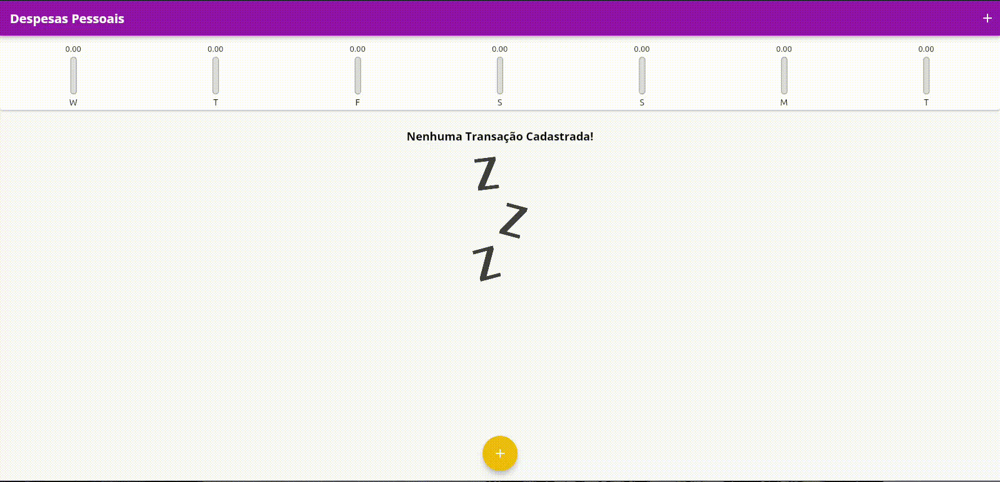
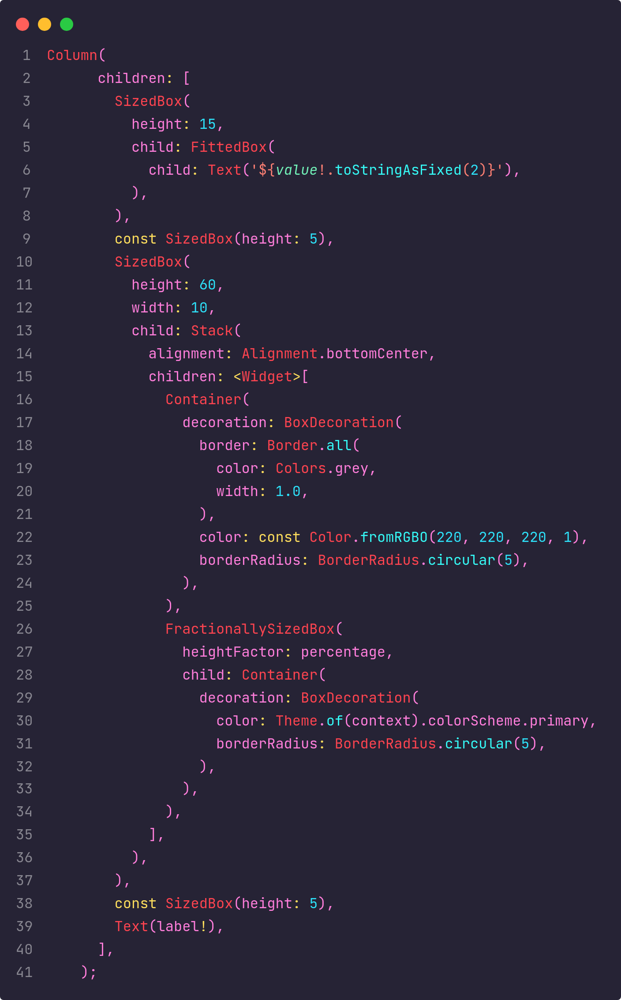

# Expenses APP 💰

_Bem-vindo à documentação do Expenses APP. Uma aplicação para gerenciamento de finanças pessoais, desenvolvida em Flutter._



---

## Menu

- [Sobre o Projeto](#sobre-o-projeto)
- [Tecnologias](#tecnologias)
- [Pacotes Utilizadas](#pacotes-utilizadas)
- [Como Usar](#como-usar)
- [Funcionalidades](#funcionalidades)
- [Destaques](#destaques)
- [Contribuição](#contribuição)
- [Redes Sociais](#redes-sociais)
- [Licença](#licença)
- [Autor](#autor)

---

## Sobre o Projeto

O Expenses APP é uma aplicação simples e intuitiva para ajudar você a gerenciar suas finanças pessoais. A interface amigável permite que você registre suas receitas e despesas de forma rápida e fácil, mantendo um controle completo sobre seu orçamento.

## Tecnologias Utilizadas


## Pacotes Utilizadas

- **intl:** Pacote para formatação de datas e números.
- **cupertino_icons:** Ícones no estilo iOS para a interface do usuário.

## Como Usar

1. **Instale o Projeto:**

   ```bash
   git clone https://github.com/GUSTAV0DEDEUS/ExpensesAPP
   cd ExpensesAPP
   ```

2. **Execute a Aplicação:**

   ```bash
   flutter run
   ```

3. **Registre Suas Transações:**

   Abra o aplicativo, adicione suas receitas e despesas, e mantenha um controle detalhado do seu orçamento.

## Funcionalidades

- **Registro de Transações:** Adicione suas transações com detalhes como categoria, data e descrição.
- **Categorias Personalizadas:** Crie suas próprias categorias para classificar suas transações.
- **Visão Geral do Orçamento:** Veja um resumo claro de suas receitas e despesas.
- **Histórico de Transações:** Acesse um histórico completo de suas transações passadas.

## Destaques



## Contribuição

Sinta-se à vontade para contribuir para o desenvolvimento deste projeto ou relatar problemas. Abra uma issue ou envie um pull request para o [repositório no GitHub](https://github.com/GUSTAV0DEDEUS/ExpensesAPP).

## Redes Sociais

[](https://www.linkedin.com/in/gustavo-de-deus-conceicao/)
[](https://github.com/GUSTAV0DEDEUS)
[](https://www.instagram.com/decode0001/)
<a href="https://www.youtube.com/@deCode001">
  
</a>

## Licença

Este projeto é licenciado sob a [Licença MIT](./LICENSE).

---


## Autor

Gustavo De Deus Conceição (Desenvolvedor Fullstacks)